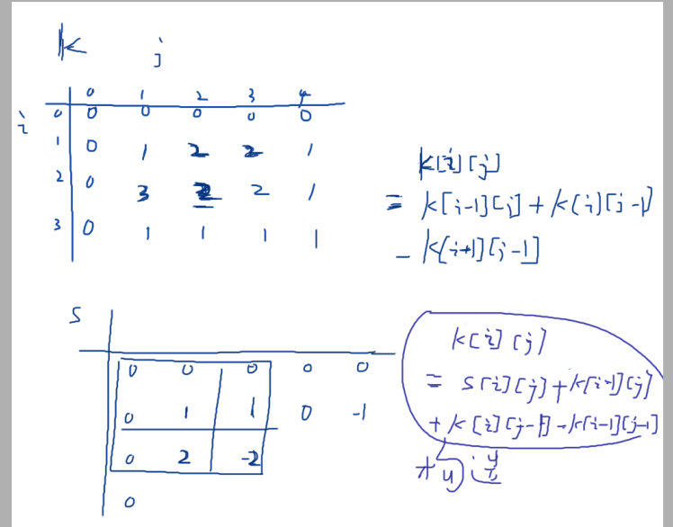
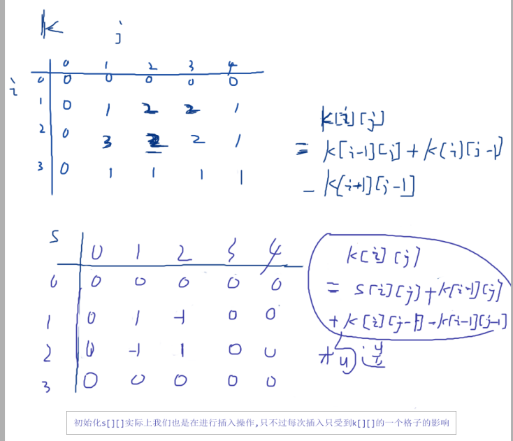

### 前缀和总结
1. 需要重新新建一个数组来存储前缀和

### 差分
1. 隐含的递归思想
2. 也要新建一个存储差分的数组
```java
for(int i=1;i<=n;i++){
    insert(i,i,a[i]);
}
```
这个相当于是间接创建差分数组

**关键点:**
差分与前缀和关系导致了能够使用他们的性质对其中一段区间做操作


注意两个数组之间的关系即可,y总的插入思想还没学会




